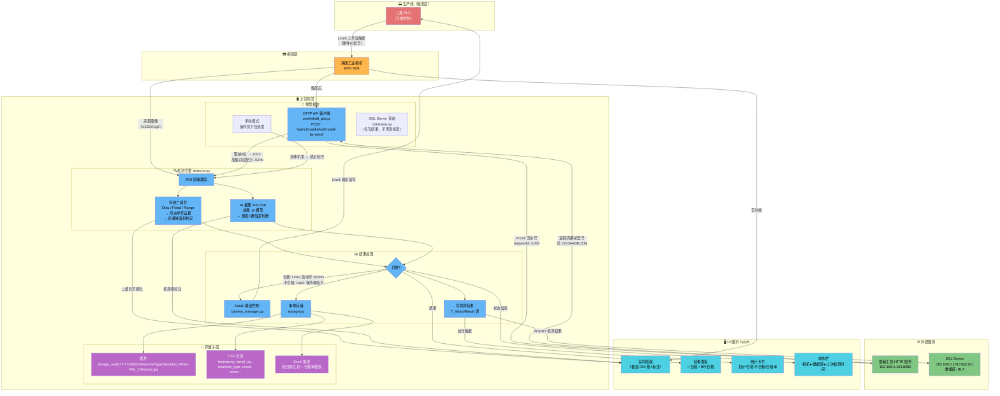
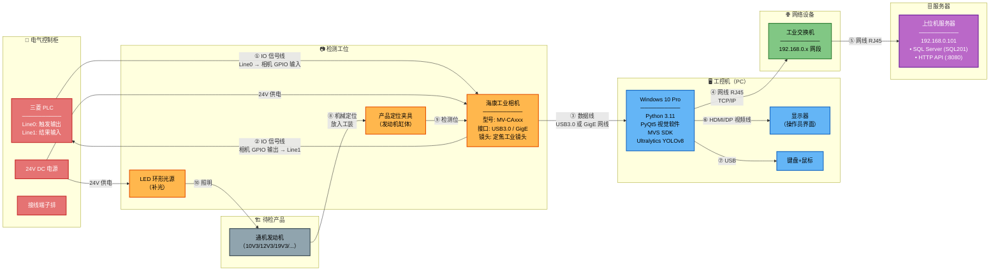
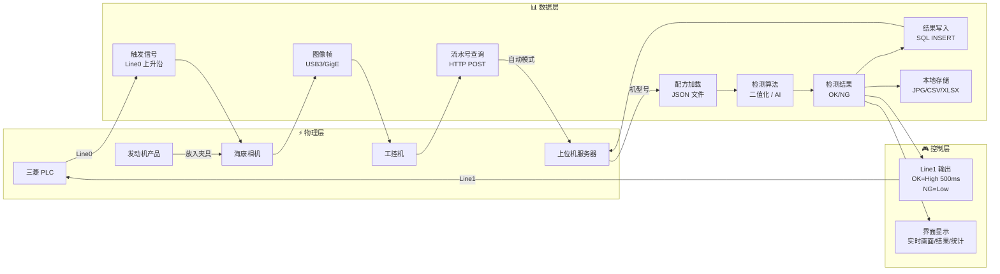

# 百力通通机视觉检测软件 — 数据流转图 & 实物连接图

> 生成日期：2026-06-10

---

## 一、数据流转图

### 数据流转关键说明

| 步骤 | 数据 | 流向 | 说明 |
|------|------|------|------|
| ① 触发 | 硬件 IO 信号 | PLC → 相机（Line0） | 上升沿触发，50µs 防抖 |
| ② 采图 | 图像帧 | 相机 → PC（SDK） | USB3.0 / GigE Vision |
| ③ 换型（自动） | 流水号 JSON | PC → HTTP API → 配方文件 | POST 请求，取前4位机型号匹配配方 |
| ③' 换型（手动） | 机型选择 | 操作员 → UI 下拉框 | 锁定配方，忽略上位机 |
| ④ 检测 | 图像 → 结果 | detector.py | 二值化或 AI，按配方配置执行 |
| ⑤ IO 输出 | 高低电平 | PC → 相机 Line1 → PLC | 合格=高电平500ms，不合格=低电平 |
| ⑥ 写库 | 检测结果 | PC → SQL Server | INSERT T_VisionResult |
| ⑦ 存储 | 图片/CSV/Excel | PC → 本地磁盘 | 按日期+机型目录组织 |

---

## 二、实物连接图

### 实物连接清单

| 序号 | 从 | 到 | 介质/协议 | 说明 |
|------|----|----|-----------|------|
| ① | PLC Line0 输出 | 相机 GPIO 输入 | 屏蔽信号线（2芯） | 触发信号，上升沿，50µs 防抖 |
| ② | 相机 GPIO 输出 | PLC Line1 输入 | 屏蔽信号线（2芯） | 结果信号，高=合格(500ms)，低=不合格 |
| ③ | 相机数据口 | 工控机 | USB3.0 / GigE 网线 | 图像数据传输 + SDK 控制 |
| ④ | 工控机网口 | 交换机 | RJ45 网线 (Cat5e+) | TCP/IP 局域网 |
| ⑤ | 交换机 | 服务器 | RJ45 网线 (Cat5e+) | SQL Server (1433) + HTTP API (8080) |
| ⑥ | 工控机显卡 | 显示器 | HDMI / DP | 操作员界面显示 |
| ⑦ | 键鼠 | 工控机 | USB | 操作输入 |
| ⑧ | 发动机 | 定位夹具 | 机械 | 保证检测位置一致 |
| ⑨ | 相机 | 夹具上方 | 支架固定 | 拍摄 ROI 区域 |
| ⑩ | 环形光源 | 发动机 | 光学 | 均匀补光，减少阴影 |

---

## 三、简化版一图总览

---

> **说明**：以上图表使用 Mermaid 语法，在 GitHub、VS Code（安装 Mermaid 插件）、Typora 等工具中可直接渲染为可视化图表。
